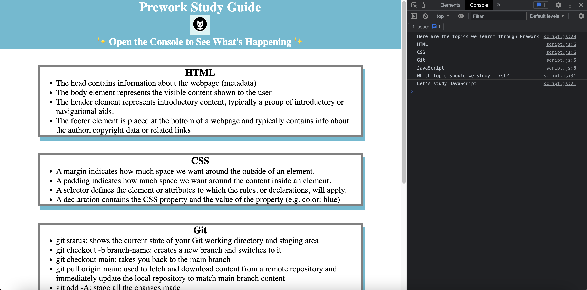

# Prework Study Guide Webpage

## Description

This Prework Study Guide has been created as means to aid beginners in learning the absolute essentials of web development. It includes helpful notes on HTML, CSS, JavaScript and Git that beginners can come back to when they need assistance. By creating this guide, I learnt how to create and deploy a webpage from scratch.  

## Installation

N/A

## Usage

To use this guide, find the topic you want to learn more on and read the information in the corresponding box. For suggestions on what to study next, open the Chrome dev tools (Cmd + Option + J on Mac; Ctrl + Shift + J on Windows or Linux) to look at the console. Here, you will see a list of the available topics that this guide covers with a suggestion on what to study first. 

## Credits

N/A

## License

Please refer to the LICENSE in the repo. 
